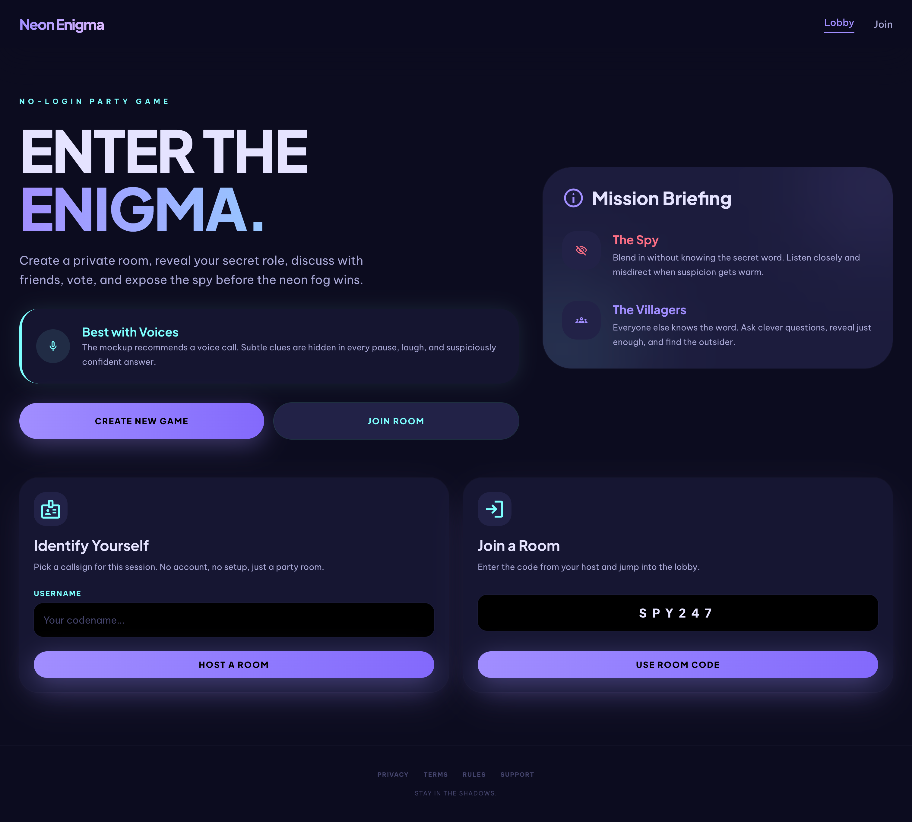

# Who's the Spy?

> A real-time multiplayer deduction game. No login required.

**[Play now → whos-the-spy-one.vercel.app](https://whos-the-spy-one.vercel.app)**



---

## What is it?

Who's the Spy? is a party game for 3–15 players. Every round, one player is secretly assigned as the **Spy** while everyone else becomes a **Civilian**. The twist: Civilians share a secret word, but the Spy receives a *similar* word instead — close enough to bluff, different enough to expose.

Players discuss, probe each other with questions, vote to eliminate the spy, and try not to give away the real word in the process. Best played over a voice call.

---

## How to play

| Phase | What happens |
|---|---|
| **Lobby** | Host creates a room and shares the code. Players join with no account needed. |
| **Role Reveal** | Each player privately sees their word. The Spy gets a similar-but-different word. |
| **Discussion** | Players take timed turns asking and answering questions to sniff out the Spy. |
| **Voting** | Everyone votes to eliminate a suspect. Ties trigger a **runoff vote** between candidates. |
| **Battle** | If the Spy is exposed, they get a 30-second last stand to guess the real word and steal the win. |
| **Results** | Win/loss is revealed with voting history. The host can kick off the next round immediately. |

Games are multi-round — the room persists and a new round starts automatically after results.

---

## Features

- **No login, no friction** — players join via a short room code, identity stored in session
- **Real-time sync** — all game state is live across every client via Convex
- **Host controls** — only the host can start rounds and set discussion/voting durations
- **Timed turns** — discussion turns and voting phases have configurable countdowns
- **Tie-breaker runoff** — tied votes trigger a focused runoff between only the tied candidates
- **Battle phase** — the outed Spy gets one last chance to name the word and reverse the result
- **Spectator support** — eliminated players watch the rest of the round play out
- **3–15 players** — spy count scales automatically with player count

---

## Tech stack

| Layer | Technology |
|---|---|
| Frontend | React 19, TypeScript, Vite |
| Styling | Tailwind CSS v4 |
| Routing | React Router v7 |
| Backend / realtime | Convex |
| Testing | Vitest, Testing Library |
| Hosting | Vercel |

---

## Local development

**Prerequisites:** Node.js 18+, a [Convex](https://convex.dev) account.

```bash
git clone https://github.com/jaaaaam/whos-the-spy.git
cd whos-the-spy
npm install
```

Start the Convex dev server (first run will prompt you to log in and create a project):

```bash
npx convex dev
```

In a separate terminal, start the frontend:

```bash
npm run dev
```

Open [http://localhost:5173](http://localhost:5173) and create a room.

```bash
npm test        # run unit tests
npm run build   # production build
```
